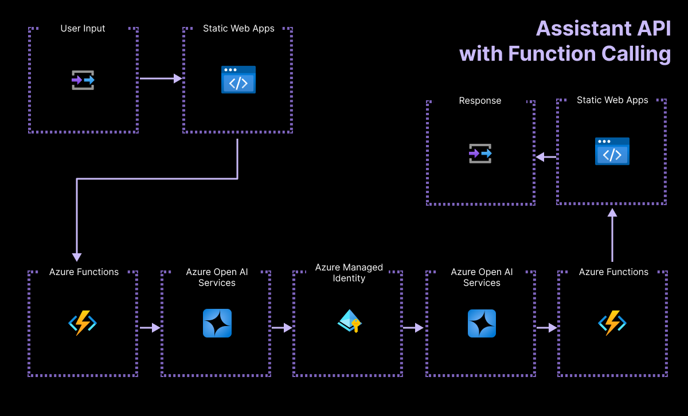

<!-- prettier-ignore -->
<div align="center">

# Serverless Azure OpenAI Assistant Quick Start<br> Function Calling

[](https://codespaces.new/Azure-Samples/azure-openai-assistant-javascript?hide_repo_select=true&ref=main&quickstart=true)
[](https://github.com/Azure-Samples/azure-openai-assistant-javascript/actions)

[](LICENSE)

:star: Like and fork this sample to receive lastest changes and updates!

[Overview](#overview) • [Get started](#get-started) • [Run the sample](#run-the-sample) • [Resources](#resources)

  

</div>

This sample shows how to quickly get started with [OpenAI Assistant](https://learn.microsoft.com/azure/ai-services/openai/how-to/assistant) on Azure. The application is hosted on [Azure Static Web Apps](https://learn.microsoft.com/azure/static-web-apps/overview) and [Azure Functions](https://learn.microsoft.com/azure/azure-functions/functions-overview?pivots=programming-language-javascript). You can use it as a starting point for building more complex Assistant and Agent applications.

## Overview

Azure OpenAI Assistants allows you to create AI assistants tailored to your needs through custom instructions and augmented by advanced tools like code interpreter, and custom functions. In this article, we provide an in-depth walkthrough of getting started with the Assistants API.

<div align="center">
  
</div>

This application is built around two main components:

- A simple HTML page with a vanilla CSS and JavaScript files, and hosted on [Azure Static Web Apps](https://learn.microsoft.com/azure/static-web-apps/overview). The code is located in the [`src`](./src/) folder.

- A serverless API built with [Azure Functions](https://learn.microsoft.com/azure/azure-functions/functions-overview?pivots=programming-language-javascript) and using OpenAI JavaScript SDK. The code is located in the [`api`](./api/) folder.

## Get started

There are multiple ways to get started with this project.

The quickest way is to use [GitHub Codespaces](#use-github-codespaces) that provides a preconfigured environment for you. Alternatively, you can [set up your local environment](#use-your-local-environment) following the instructions below.

### Use your local environment

You need to install following tools to work on your local machine:

- [Node.js LTS](https://nodejs.org/download/)
- [Azure Developer CLI](https://aka.ms/azure-dev/install)
- [SWA CLI](https://github.com/Azure/static-web-apps-cli)
- [Git](https://git-scm.com/downloads)
- [PowerShell 7+](https://github.com/powershell/powershell) _(for Windows users only)_
  - **Important**: Ensure you can run `pwsh.exe` from a PowerShell command. If this fails, you likely need to upgrade PowerShell.
  - Instead of Powershell, you can also use Git Bash or WSL to run the Azure Developer CLI commands.
- (Optional - if you are not using SWA CLI) [Azure Functions Core Tools](https://learn.microsoft.com/azure/azure-functions/functions-run-local?tabs=macos%2Cisolated-process%2Cnode-v4%2Cpython-v2%2Chttp-trigger%2Ccontainer-apps&pivots=programming-language-javascript) _(should be installed automatically with NPM, only install manually if the API fails to start)_

Then you can get the project code:

1. [**Fork**](https://github.com/Azure-Samples/azure-openai-assistant-javascript/fork) the project to create your own copy of this repository.
2. On your forked repository, select the **Code** button, then the **Local** tab, and copy the URL of your forked repository.
3. Open a terminal and run this command to clone the repo: <code> git clone &lt;your-repo-url&gt; </code>

### Use GitHub Codespaces

You can run this project directly in your browser by using GitHub Codespaces, which will open a web-based VS Code:

[](https://codespaces.new/Azure-Samples/azure-openai-assistant-javascript?hide_repo_select=true&ref&quickstart=true)

### Use a VS Code dev container

A similar option to Codespaces is VS Code Dev Containers, that will open the project in your local VS Code instance using the [Dev Containers extension](https://marketplace.visualstudio.com/items?itemName=ms-vscode-remote.remote-containers).

You will also need to have [Docker](https://www.docker.com/products/docker-desktop) installed on your machine to run the container.

[](https://vscode.dev/redirect?url=vscode://ms-vscode-remote.remote-containers/cloneInVolume?url=https://github.com/Azure-Samples/azure-openai-assistant-javascript)

## Run the sample locally (with Azure OpenAI models)

First you need to provision the Azure resources needed to run the sample. Follow the instructions in the [Deploy the sample to Azure](#deploy-the-sample-to-azure) section to deploy the sample to Azure, then you'll be able to run the sample locally using the deployed Azure resources.

Once your deployment is complete, you should see a `.env` file in the `api` folder. This file contains the environment variables needed to run the application using Azure resources.

Also, in order for the Assistant to send emails, you need to provide the following env variables in the `./api/.env` file:

```
EMAIL_RECEIVER="your email address"
EMAIL_SENDER_NAME="Azure OpenAI Assistant"
EMAIL_SENDER_USERNAME="sender email address"
# Generate an application password from the MFA mobile application
EMAIL_SENDER_APP_PASSWORD="foobar" 
```

**Important: Please follow [this guide](https://support.microsoft.com/account-billing/manage-app-passwords-for-two-step-verification-d6dc8c6d-4bf7-4851-ad95-6d07799387e9) to generate an Application Password if you are using MFA.**

To run the sample, run the following commands, which will start the web app, and the API locally.

1. Open a terminal and navigate to the root of the project, then run the API server first:

```bash
npm install --prefix api
npm start --prefix api
```

2. Open another terminal and navigate to the root of the project, then run the webapp server:

```bash
npm install
npm start
```

Open the URL `http://localhost:4280` in your browser to interact with the Assistant.

### Deploy the sample to Azure

#### Azure prerequisites

- **Azure account**. If you're new to Azure, [get an Azure account for free](https://azure.microsoft.com/free) to get free Azure credits to get started. If you're a student, you can also get free credits with [Azure for Students](https://aka.ms/azureforstudents).
- **Azure subscription with access enabled for the Azure OpenAI service**. You can request access with [this form](https://aka.ms/oaiapply).

#### Deploy the sample

1. Open a terminal and navigate to the root of the project.
2. Authenticate with Azure by running `azd auth login`.
3. Run `azd up` to deploy the application to Azure. This will provision Azure resources, deploy this sample.
   - You will be prompted to select a base location for the resources.
   - By default, the OpenAI resource will be deployed to `swedencentral`. You can set a different location with `azd env set AZURE_OPENAI_RESOURCE_GROUP_LOCATION <location>`. Currently only a short list of locations is accepted. **Azure OpenAI Assistants are currently available in Sweden Central, East US 2, and Australia East. For more information about model availability in those regions, [see the models guide](https://learn.microsoft.com/azure/ai-services/openai/concepts/models).**

The deployment process will take a few minutes. Once it's done, you'll see the URL of the web app in the terminal.

You can now open the web app in your browser and start chatting with the bot.

#### Clean up

To clean up all the Azure resources created by this sample:

1. Run `azd down --purge`
2. When asked if you are sure you want to continue, enter `y`

The resource group and all the resources will be deleted.

## Resources

Here are some resources to learn more about the technologies used in this sample:

- [Get started using Azure OpenAI Assistants (Preview)](https://learn.microsoft.com/azure/ai-services/openai/assistants-quickstart?tabs=command-line%2Ctypescript&pivots=programming-language-javascript)
- [Generative AI For Beginners](https://github.com/microsoft/generative-ai-for-beginners)
- [Azure OpenAI Service](https://learn.microsoft.com/azure/ai-services/openai/overview)
- [Azure Cosmos DB for MongoDB vCore](https://learn.microsoft.com/azure/cosmos-db/mongodb/vcore/)
- [Azure OpenAI Assistant Builder](https://github.com/Azure-Samples/azure-openai-assistant-builder)
- [Chat + Enterprise data with Azure OpenAI and Azure AI Search](https://github.com/Azure-Samples/azure-search-openai-javascript)

You can also find [more Azure AI samples here](https://github.com/Azure-Samples/azureai-samples).

## Troubleshooting

If you can't find a solution to your problem, please [open an issue](https://github.com/Azure-Samples/azure-openai-assistant-javascript/issues) in this repository.

## Contributing

This project welcomes contributions and suggestions. Most contributions require you to agree to a
Contributor License Agreement (CLA) declaring that you have the right to, and actually do, grant us
the rights to use your contribution. For details, visit https://cla.opensource.microsoft.com.

When you submit a pull request, a CLA bot will automatically determine whether you need to provide
a CLA and decorate the PR appropriately (e.g., status check, comment). Simply follow the instructions
provided by the bot. You will only need to do this once across all repos using our CLA.

This project has adopted the [Microsoft Open Source Code of Conduct](https://opensource.microsoft.com/codeofconduct/).
For more information see the [Code of Conduct FAQ](https://opensource.microsoft.com/codeofconduct/faq/) or
contact [opencode@microsoft.com](mailto:opencode@microsoft.com) with any additional questions or comments.

## Trademarks

This project may contain trademarks or logos for projects, products, or services. Authorized use of Microsoft
trademarks or logos is subject to and must follow
[Microsoft's Trademark & Brand Guidelines](https://www.microsoft.com/legal/intellectualproperty/trademarks/usage/general).
Use of Microsoft trademarks or logos in modified versions of this project must not cause confusion or imply Microsoft sponsorship.
Any use of third-party trademarks or logos are subject to those third-party's policies.
